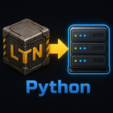

# LTN Analitic

Standalone analytics mod for **Factorio 2.0** and Logistic Train Network. It records delivery, order, train, station, and event data as versioned JSONL packets in Factorio's `script-output`. The mod has no database connection and does not require the companion Gateway to run.



## Requirements

- Factorio 2.0
- Logistic Train Network 2.0.0 or newer
- Optional compatibility mods listed in [info.json](info.json)

## JSONL recording

Recording is enabled by default. Change **Settings → Mod settings → LTN Analitic → Write JSONL snapshots to script-output** to pause or resume it. Turning recording off clears the pending buffer; events from the paused period are not exported when recording resumes.

Default output path on Windows:

```text
%APPDATA%\Factorio\script-output\LTN_Analitic\data.jsonl
```

Useful in-game commands:

| Command | Purpose |
| --- | --- |
| `/ltn_debug_jsonl` | Show recording state, sequence, and buffer sizes |
| `/ltn_write_jsonl` | Write a packet immediately when recording is enabled |
| `/ltn_debug_world_id` | Show the current world's persistent identifier |
| `/ltn_debug_orders` | Show active deliveries |
| `/ltn_debug_buffer` | Show the pending send buffer |
| `/ltn_debug_send_data` | Show the assembled snapshot |

See [troubleshooting](docs/troubleshooting.md) for output and save-migration guidance.

## Companion Gateway

The optional [LTN Analytics Gateway](https://github.com/Zorngeist-Qual/LTN-Analytics-Gateway) is a separate application that imports the mod's JSONL into PostgreSQL. It is not included in the Factorio mod and has its own documentation in that project's repository. The Gateway repository currently provides source code; check its [Releases page](https://github.com/Zorngeist-Qual/LTN-Analytics-Gateway/releases) for binary packages.

## Mod development

The source Lua files are in `code/`; Factorio expects runtime Lua files at the root of the installed mod folder. Local staging instructions, architecture, and the JSONL contract are documented here:

- [Installation and local staging](docs/installation.md)
- [Mod architecture](docs/architecture.md)
- [Factorio implementation](docs/factorio-mod.md)
- [JSONL data contract and schemas](docs/data-contract.md)
- [Development and release checks](docs/development.md)
- [Companion Gateway links](docs/gateway.md)

## Repository layout

```text
code/       Factorio Lua sources, including settings.lua
locale/     English and Russian setting labels
schemas/    JSON Schema for the JSONL contract
docs/       Mod installation and technical documentation
gateway/    Companion Gateway source and its documentation
info.json   Factorio mod metadata
```

The Factorio mod package contains `info.json`, the Lua files from `code/` at its root, and `locale/`. Do not include the `gateway/`, `schemas/`, or `docs/` directories in the published mod archive.
